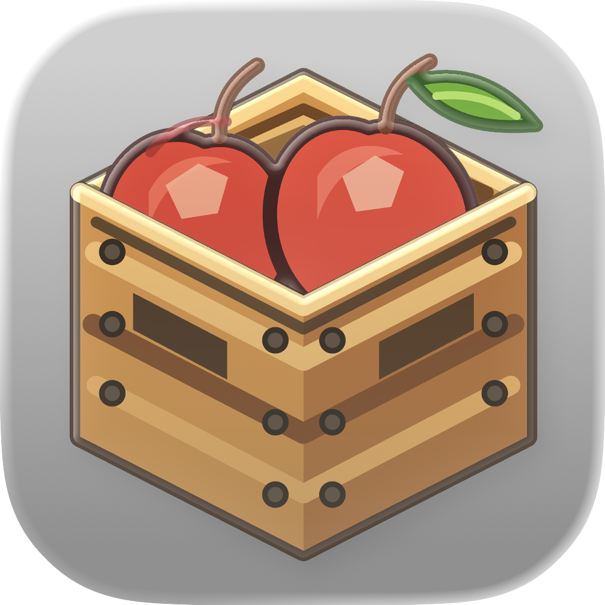
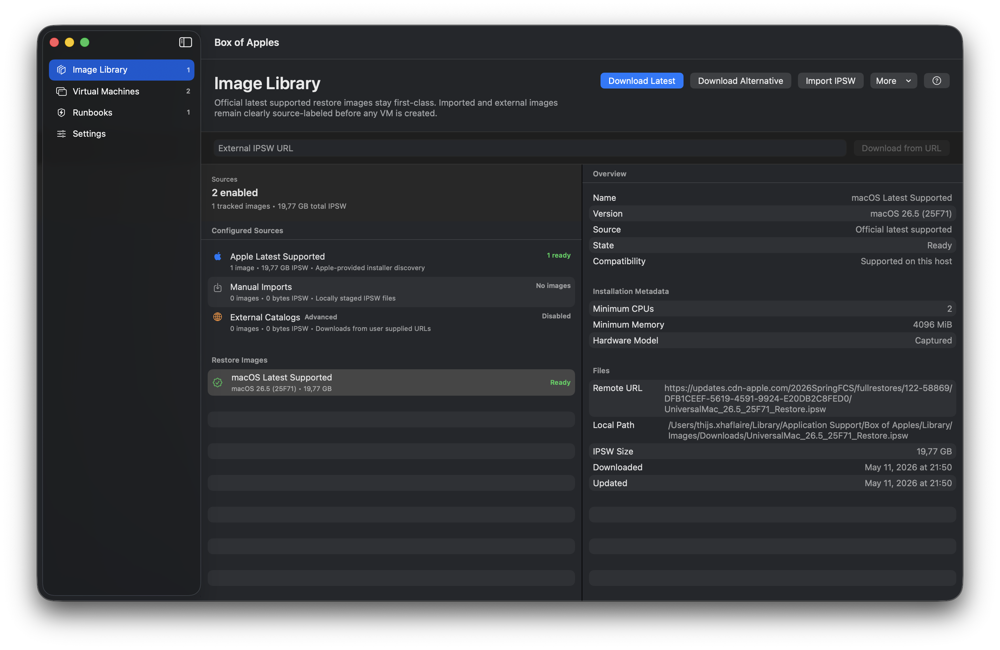
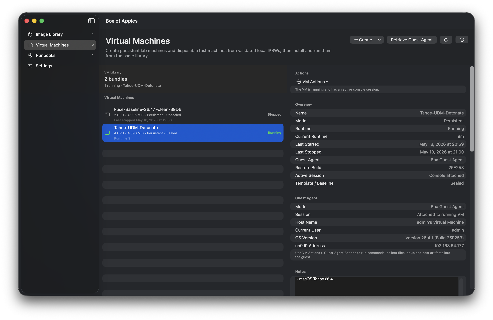
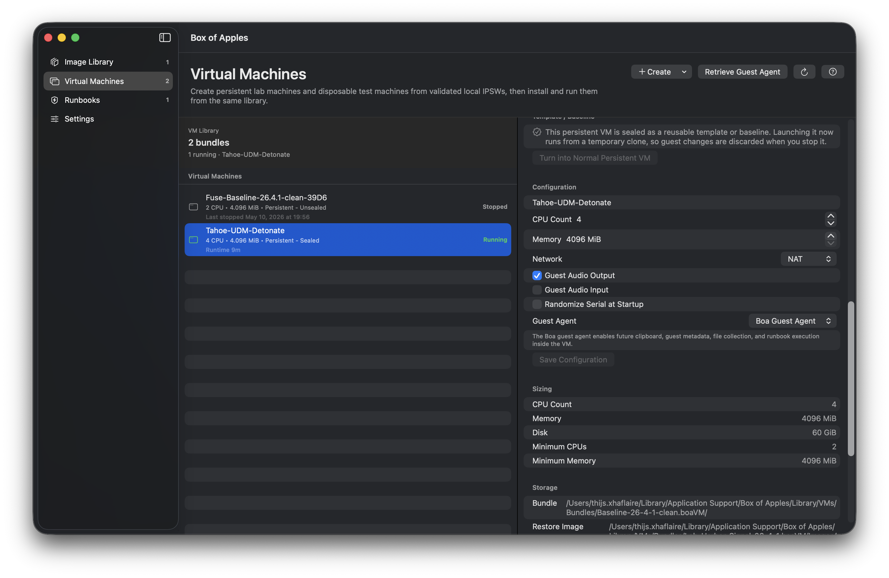
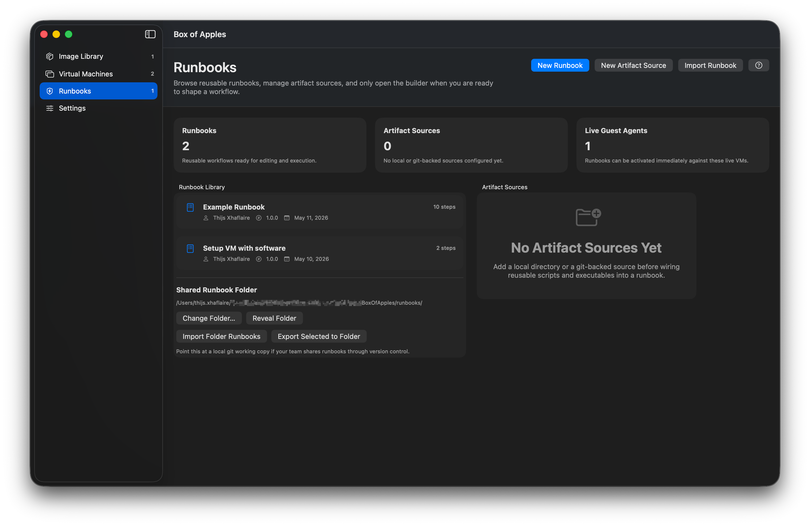
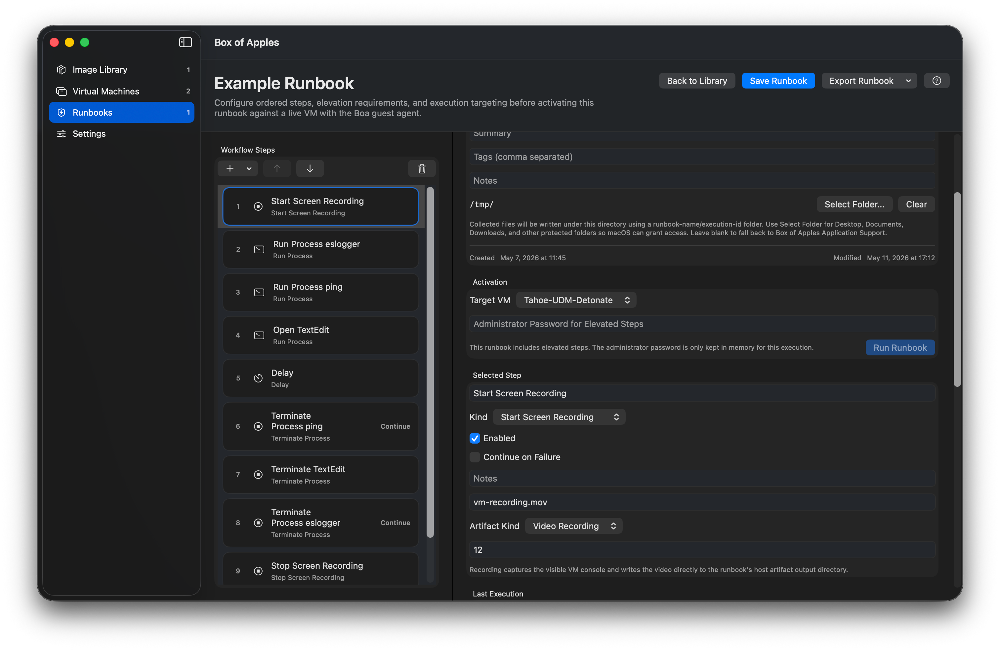

<p align="center">
  
</p>

<h1 align="center">Box of Apples</h1>

<p align="center">
  Apple Virtualization Workspace for creating, managing, running, and automating Apple silicon macOS virtual machines.
</p>

<p align="center">
  <a href="#install"></a>
  <a href="#requirements"></a>
</p>

Box of Apples is a focused desktop workspace for repeatable macOS VM labs. It keeps restore images, VM bundles, disposable runs, guest-agent automation, and runbook history organized in one place.

## Highlights

| Area | What you can do |
| --- | --- |
| Image Library | Discover Apple's latest supported restore image, download managed IPSWs, import local IPSWs, use optional external URLs, and keep source labels plus compatibility metadata visible before creating a VM. |
| Virtual Machines | Create persistent VM bundles, install macOS, start in normal or Recovery mode, stop, suspend, resume, inspect logs, and reveal bundles in Finder. |
| Templates and disposables | Seal a persistent VM as a clean template, clone disposable lab machines from it, and convert a useful disposable run back into a persistent VM. |
| Guest Agent | Retrieve the bundled guest-agent package, connect to live guests, inspect guest info, use clipboard/file operations, and run automated guest processes through a local vsock channel. |
| Runbooks | Build reusable workflows from ordered steps, wire in local or git-backed artifact sources, run against live guest-agent VMs, collect outputs, record execution history, and import/export runbook JSON. |
| CLI | Use the bundled `boa` command for image, VM, template, and settings workflows, with JSON output for scripting. |
| Settings | Tune default disk size, disk format, NAT or bridged networking, serial randomization, external IPSW policy, and idle auto-suspend behavior. |

## Requirements

- Apple silicon Mac.
- macOS 26 or later.
- Enough free disk space for IPSW downloads and VM bundles. A single macOS VM can easily need tens of GB.
- Administrator access for installing the package and for guest actions that explicitly require elevation.

## Install

1. Download and run the latest `Box of Apples-*.pkg` from this repository's Releases page.
2. Launch **Box of Apples** from `/Applications`.

## First Run

Start in the Image Library:

1. Use **Download Latest** to fetch Apple's latest restore image supported by your Mac, or use **Import IPSW** if you already have one.
2. Go to **Virtual Machines** and create a persistent VM from a ready image.
3. Install macOS into the VM, then start it from the same library.
4. Optional: choose **Retrieve Guest Agent** and install the guest package inside the VM when you want runbook automation.
5. Build runbooks for repeatable guest workflows, artifact collection, and disposable test runs.

## Command Line

The package includes the `boa` CLI inside the app bundle:

```sh
"/Applications/Box of Apples.app/Contents/Resources/boa" --help
```

For regular terminal use, add a symlink:

```sh
sudo ln -sf "/Applications/Box of Apples.app/Contents/Resources/boa" /usr/local/bin/boa
boa image discover-latest
boa image download-latest
boa vm list
```

Useful command groups:

```text
boa image      Manage restore images
boa vm         Manage virtual machines
boa template   Manage sealed template baselines and disposable VMs
boa settings   Inspect and update Box of Apples settings
```

Most list and mutation commands support `--json` for automation.

## Guest Agent

Box of Apples can bundle a separate `BoxofApplesGuestAgent-*.pkg` for guest-side automation. From the app, use **Virtual Machines -> Retrieve Guest Agent** to save the package somewhere the guest can access, then install it inside the macOS VM.

With the guest agent connected, runbooks can target live VMs for process execution, guest metadata, file collection, clipboard workflows, and artifact-oriented automation.

## Data Locations

Box of Apples stores its working library under:

```text
~/Library/Application Support/Box of Apples/
```

Important subfolders:

```text
Library/Images/          Managed IPSWs and restore-image metadata
Library/VMs/Bundles/     Persistent VM bundles
Library/VMs/DisposableRuns/
Library/Runbooks/        Runbook definitions and execution history
Library/Artifacts/       Artifact sources, caches, and collected outputs
```

Use **Settings -> Locations** in the app to reveal the main folders in Finder.

## Screenshots

<p align="center">
  
  
  
  
  
</p>

## Troubleshooting

- **No create-ready image:** download the latest supported IPSW or import a compatible local IPSW first.
- **VM will not start:** check that the restore image is supported on the current host and that the VM has completed installation.
- **No eligible runbook target:** start a VM with Boa Guest Agent enabled and confirm the guest agent is connected.
- **CLI command not found:** run the CLI from the app bundle path or create the `/usr/local/bin/boa` symlink shown above.
- **Disk pressure:** inspect the image library, persistent bundles, and disposable runs from Settings.
